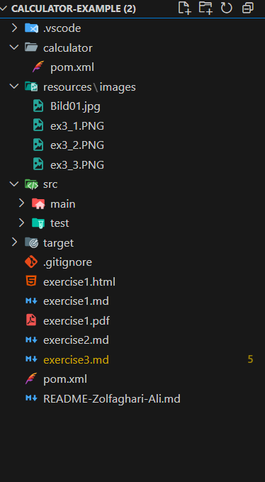
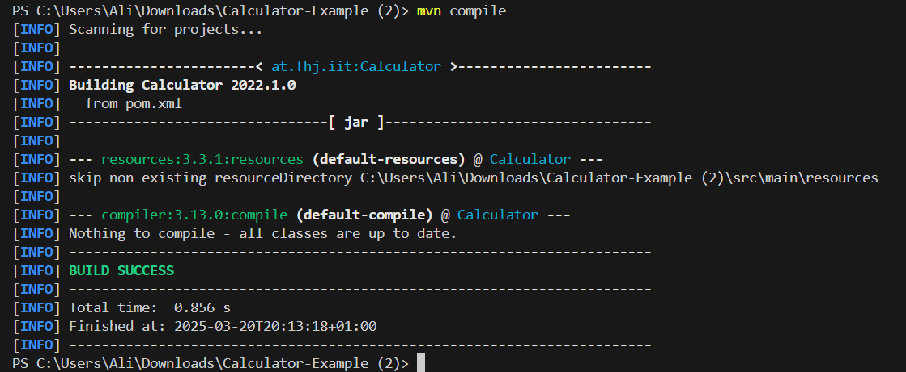
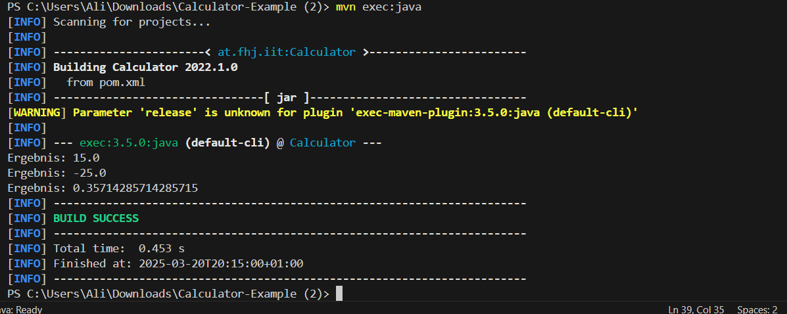

# Übung 3: Maven-Projektstruktur und Git

## Schritte zur Durchführung:

1. **Erstellung eines Maven-Projekts**   
    Das Projekt wurde mit folgendem Befehl generiert:

    ```sh
    mvn archetype:generate "-DgroupId=at.fhj.msd" "-DartifactId=calculator" "-DarchetypeArtifactId=maven-archetype-quickstart"
    "-DarchetypeVersion=1.5" "-DinteractiveMode=false"
    ```

2. **Git-Integration:**  
  Nach der Erstellung des Maven-Projekts wurde die Versionskontrolle mit Git eingerichtet. 

3. **Implementierung der `Calculator`-Klasse:**  
   Die Klasse **Calculator** und **Main.java** wurde implementiert, um grundlegende mathematische Operationen durchzuführen.
4. **Build-Automatisierung:**  
  Die `pom.xml` wurde für die Kompilierung und Ausführung des Projekts konfiguriert.
  Kompilierung des Projekts mit:
     ```sh
     mvn compile
     ```

     ```sh
     mvn exec:java
     ```

5. **Dokumentation:**  
   Alle Arbeitsschritte wurden dokumentiert. Zusätzlich wurden Screenshots erfasst.

## Screenshots

- **Projektstruktur**  
  
  

- **Erfolgreiche Kompilierung ( Screenshot Build-Erfolg)**  
  
  

- **Maven-Execution**  
  
  
